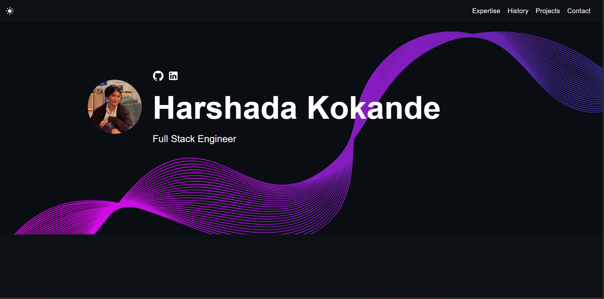

# Harshada Kokande – Developer Portfolio 🚀



Personal developer portfolio showcasing my projects, skills, and professional journey.


## About Me

Hi, I'm **Harshada Kokande**, a passionate **Full Stack Engineer** with a strong interest in building modern, scalable, and user-friendly web applications. I enjoy working on both frontend and backend technologies and love turning ideas into real-world products.

---

## Tech Stack

- **Frontend:** React, TypeScript, JavaScript, HTML5, SCSS  
- **Backend:** Node.js, Flask  
- **Databases:** MongoDB  
- **Tools:** Git, GitHub, Postman, Material UI  
- **Other:** REST APIs, Zustand, Email Forms (Formspree)

---

## Features

- Responsive and mobile-friendly design  
- Light & Dark mode support  
- Project showcase with live demos and GitHub links  
- Career timeline  
- Contact form with email integration  
- Clean and modern UI  

---

## Projects Highlighted

Some of the key projects featured in this portfolio:

- **EURUSYS Contract Management Platform** – React + TypeScript + Zustand  
- **Stock Trading Platform (Zerodha Clone)** – React + TypeScript  
- **MedConnect++** – React + Flask + MongoDB + ML  
- **FarmSmart** – Reinforcement Learning (Python)  

Each project includes a short description and a link to its GitHub repository.

---

## Run Locally

To run this project on your local machine:

```bash
git clone https://github.com/Harshadakokande/Harshada_Portfolio.git
cd Harshada_Portfolio
npm install
npm run dev
